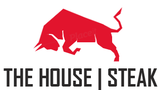
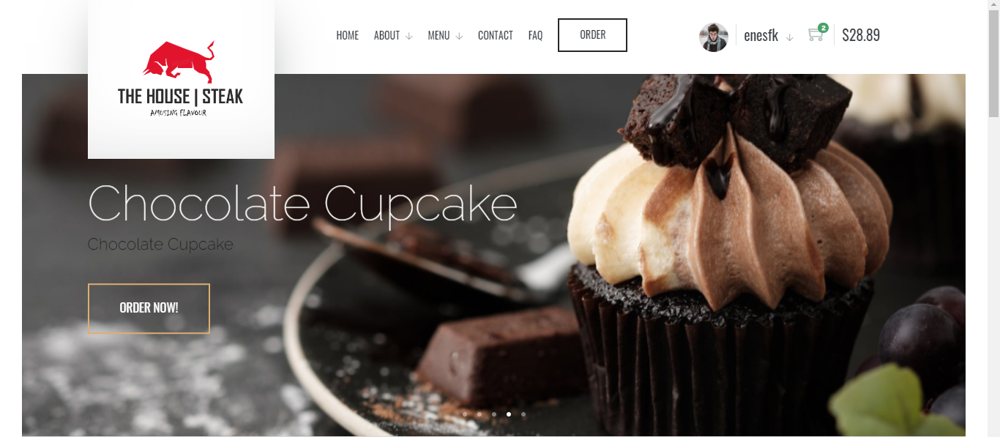
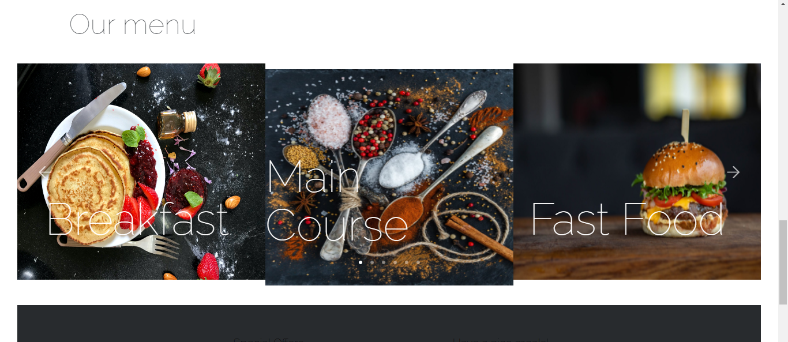
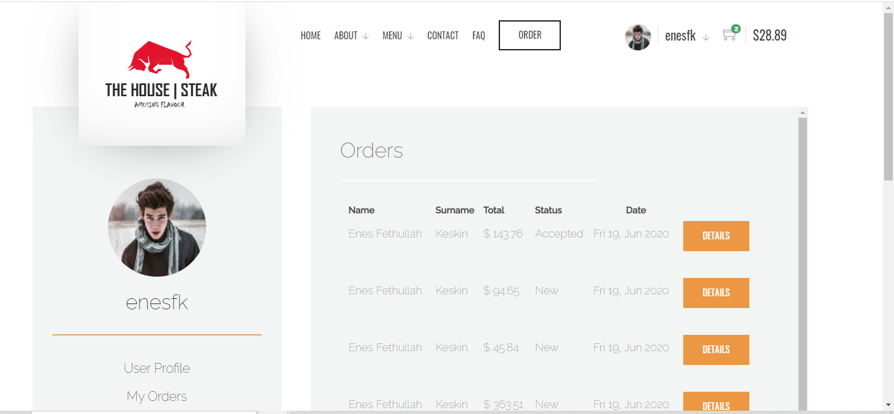
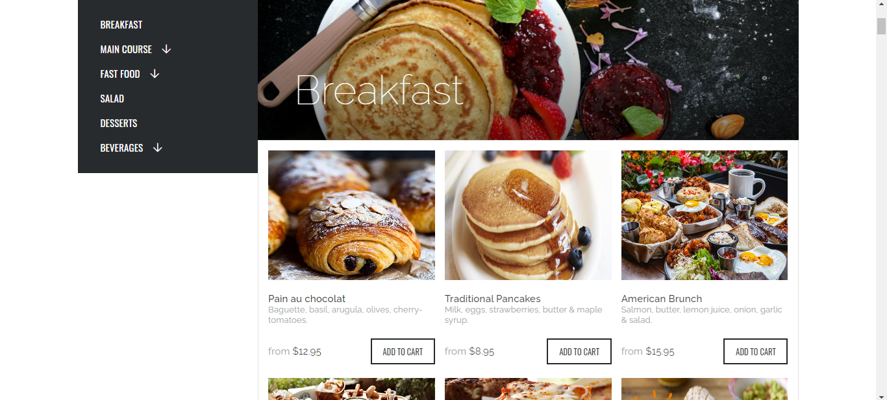

<p align="center">
  
</p>

<h1 align="center">The House | Steak - Ordering, Booking and Menu</h1>

<p align="center"> 🍔 🥂 An awesome web application built with Python-Django that includes ordering, booking and menu list. 🍽️	  </p>

<p align="center">
  <strong>
    <a href="#about">About</a> • 
    <a href="#features">Features</a> • 
    <a href="#built-with">Built with</a> • 
    <a href="#getting-started">Getting Started</a> • 
    <a href="#prerequisites">Prerequisites</a> • 
    <a href="#installation">Installation</a> • 
    <a href="#usage">Usage</a> • 
    <a href="#screenshots">Screenshots</a> • 
    <a href="#contributing">Contributing</a> • 
    <a href="#support--feedback">Support & Feedback</a> • 
    <a href="#license">License</a>  
  </strong>
</p>


## About

The House | Steak is a restaurant ordering web application with MVC architecture built with Python-Django. 
It includes all the features that a modern cafe or restaurant should have, from booking and ordering to menu and product reviews. 
In the admin panel, the admin can manage all products, orders, users and company information, and on the other hand, users can perform
many operations such as editing the profile, ordering, product evaluation, checkout, product search, adding products to the cart and viewing past orders.


### Features
Some of the features the project includes:

- Online Ordering System
- Sign in, Sign up and User Profile
- Product Reviews and Ratings
- Hierarchical Category
- Admin Panel
- Adding Products the Cart
- Functional Menu Component
- Modern Design
- Model-View-Controller Architecture
- Compatible for Mobile and Tablet
- Effective Navigation
- Contact Form, About Us, FAQ
- Generating Order Code
- Checkout Form

### Built with
Technologies such as **Python** (v3.9) and **Django** in the backend, **SQLite3** in the database architecture and 
**JavaScript**, **Bootstrap4**, **JQuery**, **AJAX**, **HTML5** and **CSS3** in the frontend were used in the development of the project.

- [Python](https://www.python.org/) - Python is an interpreted high-level general-purpose programming language.
- [Django](https://www.djangoproject.com/) - Django is a Python-based free and open-source web framework that follows the model–template–views architectural pattern.
- [SQLite](https://www.sqlite.org/index.html) - SQLite is a relational database management system contained in a C library.
- [JavaScript](https://www.javascript.com/) - JavaScript, often abbreviated as JS, is a programming language that conforms to the ECMAScript specification.
- [Bootstrap](https://getbootstrap.com/) - Bootstrap is a free and open-source CSS framework directed at responsive, mobile-first front-end web development.

<p align="center"> 
<a href="https://www.python.org/">
  
</a>&nbsp;
  
<a href="https://www.djangoproject.com/">
  
</a>&nbsp;


<a href="https://www.sqlite.org/index.html">
  
</a>&nbsp;    
  
<a href="https://www.javascript.com/">
  
</a>&nbsp;

  
<a href="https://getbootstrap.com/">
  
</a>&nbsp;
  
</p>  


## Getting Started

The following instructions will get you a copy of the project up and running on your local machine for development and testing purposes.
  
### Prerequisites

To run this project in production or development mode you have to make sure, [Python](https://www.python.org/downloads/) is installed on your computer. If you opted to install an older version of Python, it is possible that it did not come with `Pip` preinstalled.

- To check Python and Pip are installed on your machine:
```bash
# Python
python --version

# Pip
pip --version
```
### Installation

To get this project, clone the repository directly using git or download a zip copy from the [master branch on Github](https://github.com/enessfk/TheHouseSteak/archive/refs/heads/master.zip). 

```bash
git clone https://github.com/enessfk/TheHouseSteak.git TheHouseSteak
```

Instead of using the operating system-wide defined Python to install all the dependencies, you can create a virtual environment to keep all the required dependencies for your project separate from your other projects. To install virtualenv package:

```bash
pip install virtualenv
```
In a terminal, run the following command to create virtual environment in the base directory of this project:

```bash
virtualenv venv
```
This command will create a new `venv` folder in your project directory. You can activate the python environment by running the following command:

```bash
# Mac OS or Linux
source venv/bin/activate

# Windows
venv\Scripts\activate
```
You should see the name of your virtual environment in brackets on your terminal line e.g. (venv).

To install the dependencies, run this from the command-line:

```bash
pip install -r requirements.txt
```
The project is now ready to run. To run the project, run this command in the directory where the `manage.py` file is located:
 
 ```bash
python manage.py runserver
 ```

## Usage
There are several users defined in the project, one of which is admin. 
All these users have the same passwords. Required user information to login both the admin panel and the web application:

> **Username :** *admin* <br>
> **Password :** *housesteak16*

You can access the django admin panel at http://127.0.0.1:8000/admin.

## Screenshots

<p align="center">
   
    
</p>

<p align="center">
    
  
</p>

## Contributing
Want to contribute? Great!
To fix a bug or enhance an existing module, follow these steps:

1. Fork the Project
2. Create your Feature Branch (`git checkout -b feature/enhanced-feature`)
3. Commit your Changes (`git commit -m 'Add some enhanced-feature'`)
4. Push to the Branch (`git push origin feature/enhanced-feature`)
5. Open a Pull Request


## Support & Feedback
If you are having technical issues or want to raise a bug/issue with the app, the preferred way is through [GitHub issues](https://github.com/enessfk/TheHouseSteak/issues). 
In order to contact with me for any other request please send an email to: **eneskeskinfk@gmail.com**

## License

Distributed under the MIT License. See `LICENSE` for more information.

